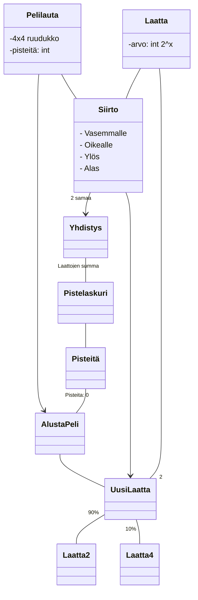
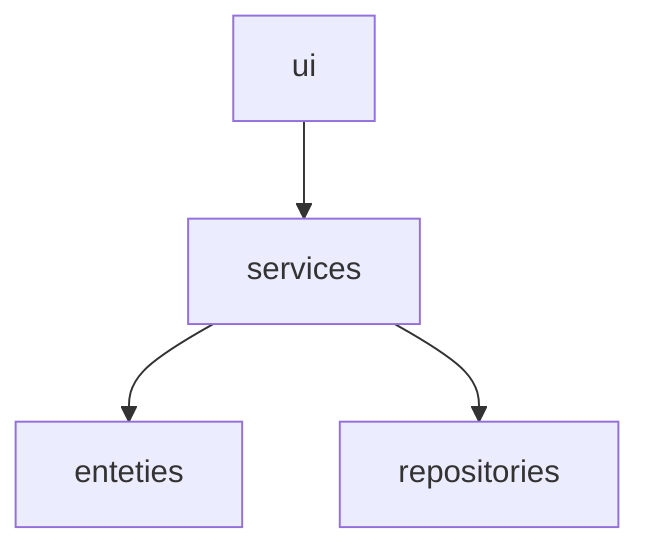
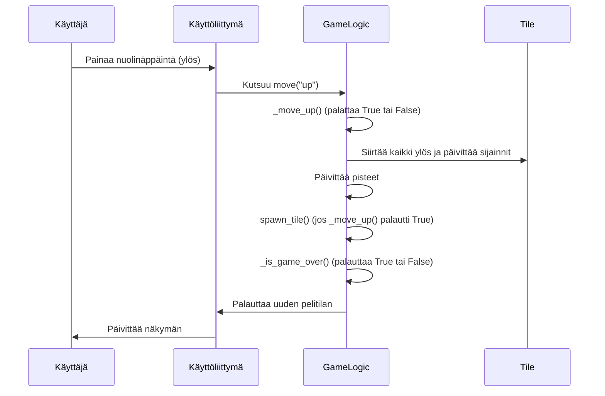

# Arkkitehtuurikuvaus

## Luokkakaavio

## Pakkauskaavio

Pakkaus *ui* käytää *services* pakkauksessa olevaa pelilogiikkaa. *services* käyttää *entities* pakkausta sillä siellä ovat *Board* ja *Tile*. *services* myös käyttää *repositories* sisältämää pysyvää muistia tallentamaan pelajaan parasta tulosta.

## Käyttöliittymä
Käyttäjällä on kolme mahdollista näkymää
1. Alkunäyttö
   - Tulee esille vain avatessa pelin
   - Pelaaja voi aloittaa pelin tai poistua
2. Pelinäkymä
   - Missä itse peli sijaisee
   - Pelaaja myös näkee tämänhetkiset pisteet
3. Häviö näkymä
   - Tulee häviämisen jälkeen automaattisesti
   - Pelaaja näkee että peli loppui ja saamansa pisteet
   - Pelaaja voi aloittaa uudelleen tai poistua

## Sovelluslogiikka

Pelisilmukka koostuu kolmesta pääluokasta:
1. GameLogic
    - Hallitsee pelin päälogiikan:
          - Liikkeet
          - Yhdistämiste
          - Pisteet
          - Pelitlan
      
2. Tile
    - Edustaa yksittäistä laattaa ruudukossa, sisältää sen arvon ja sijainnin
      
3. GameConfig
   - Sisältää pelin asetukset (esim. ruudukon koko, laattojen värit)
   
### Pääsilmukka
Yhden siirron tapahtumat

### Siirtologiikka
Jokainen pelin suunta (vasen, oikea, ylös, alas) toimii saman periaatteen mukaan:

1. Laatat siirretään
   - Kaikki laatat liukuvat haluttuun suuntaan
   - Esim. *_move_left()* siirtää kaikki laatat vasemmalle
  
2. Yhdistäminen
   - Saman arvoiset laatat jotka osuvat toisiinsa yhdistyvät
   - Muodostavat uuden laatan jonka arvo on edellisen kahden summa
  
3. Liikkumisen tunnistus
   - Metodi palauttaa True jos laatat liikkuivat

4. Uuden laatan luominen
   - Uusi laatta luodaan jos metodi palautti True
   - Valitaan satunnainen tyhjä ruutu
   - 90% todennäköisyydellä luodaan ruutu arvolla 2
   - 10% todennäköisyydellä luodaan ruutu arvolla 4
  
5. Pelin loppumisen tarkistus
   - Tarkistetaan onko tyhjää tilaa
   - Tarkistetaan onko vierekkäisi saman arvoisia
   - Jos kummatkin epätosia peli loppuu (game_over = True)

