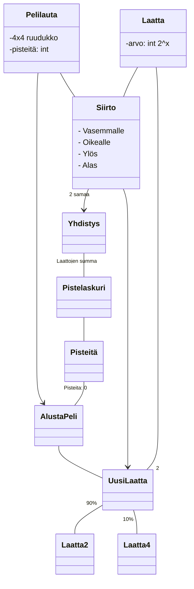
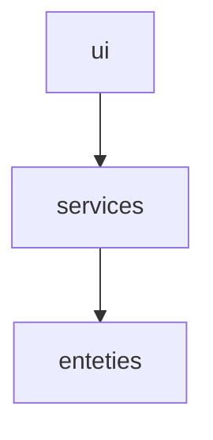

# Arkkitehtuurikuvaus

## Luokkakaavio

## Pakkauskaavio

Pakkaus *ui* käytää *services* pakkauksessa olevaa pelilogiikkaa. *services* käyttää *entities* pakkausta sillä siellä ovat *Board* ja *Tile*.

## Käyttöliittymä
Käyttäjällä on kolme mahdollista näkymää
1. Alkunäyttö
   - Tulee esille vain avatessa pelin
   - Pelaaja voi aloittaa pelin tai poistua
2. Pelinäkymä
   - Missä itse peli sijaisee
   - Pelaaja myös näkee tämänhetkiset pisteet
3. Häviö näkymä
   - Tulee häviämisen jälkeen automaattisesti
   - Pelaaja näkee että peli loppui ja saamansa pisteet
   - Pelaaja voi aloittaa uudelleen tai poistua
   
