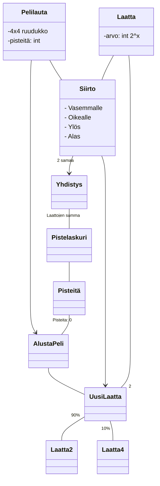

# Arkkitehtuurikuvaus

## Luokkakaavio

```mermaid
classDiagram

    class Laatta {
        -arvo: int 2^x
    }

    class Pelilauta {
        -4x4 ruudukko
        -pisteitä: int
    }

    class Siirto {
        - Vasemmalle
        - Oikealle
        - Ylös
        - Alas
    }

    Pelilauta --> AlustaPeli
    Pisteitä"Pisteita: 0" -- AlustaPeli
    AlustaPeli -- UusiLaatta
    UusiLaatta "2" -- Laatta
    UusiLaatta "90%" -- Laatta2
    UusiLaatta "10%" -- Laatta4
    Pelilauta -- Siirto
    Siirto "2 samaa" --> Yhdistys
    Laatta -- Siirto
    Yhdistys "Laattojen summa" -- Pistelaskuri
    Pistelaskuri -- Pisteitä
    Siirto --> UusiLaatta

```
