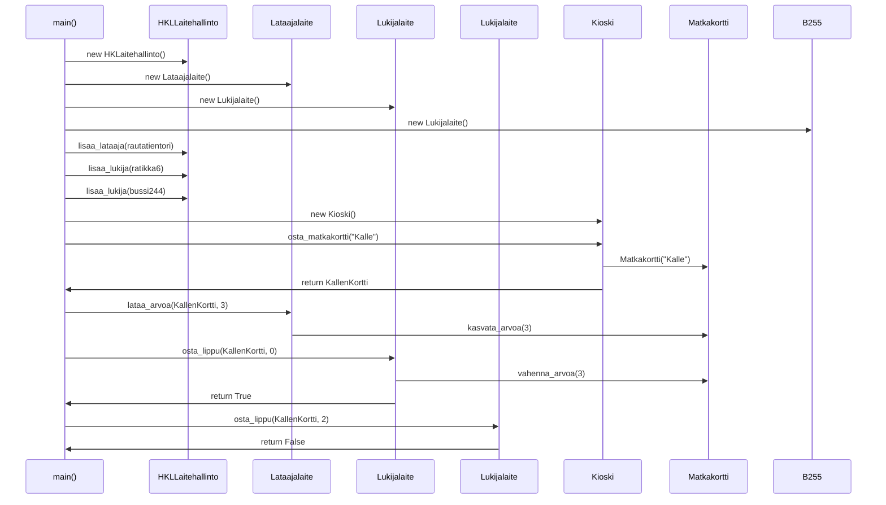

```mermaid

sequenceDiagram
    participant Main as main()
    participant HL as HKLLaitehallinto
    participant LT as Lataajalaite
    participant R6 as Lukijalaite
    participant B244 as Lukijalaite
    participant Kioski 
    participant MK as Matkakortti

    Main ->> HL: new HKLaitehallinto()
    Main ->> LT: new Lataajalaite()
    Main ->> R6: new Lukijalaite()
    Main ->> B255: new Lukijalaite()
    Main ->> HL: lisaa_lataaja(rautatientori)
    Main ->> HL: lisaa_lukija(ratikka6)
    Main ->> HL: lisaa_lukija(bussi244)
    Main ->> Kioski: new Kioski()
    Main ->> Kioski: osta_matkakortti("Kalle")
    Kioski ->> MK: Matkakortti("Kalle")
    Kioski ->> Main: return KallenKortti
    Main ->> LT: lataa_arvoa(KallenKortti, 3)
    LT ->> MK: kasvata_arvoa(3)
    Main ->> R6: osta_lippu(KallenKortti, 0)
    R6 ->> MK: vahenna_arvoa(3)
    R6 ->> Main: return True
    Main ->> B244: osta_lippu(KallenKortti, 2)
    B244 ->> Main: return False
```
